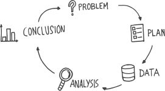

# The Art of Statistics

We need data literacy to be able to do:

* stats analysis on real world problem
* understand and critique conclusions drawn by others on the basis of stats

### Getting Things in Proportion

