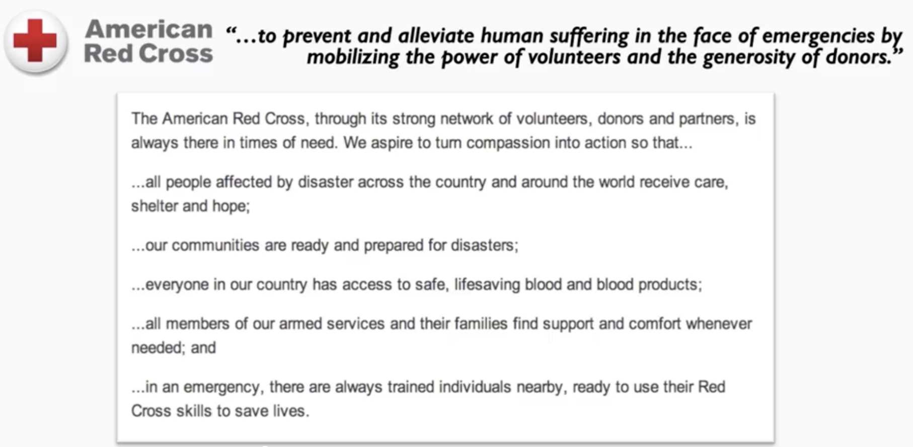

# Inspiring & Motivating People

### Becoming A Visionary Leader

#### Introduction

Performance of the team is influences ~ 30% by the leader

The most impact is:

* Create and communicate a vision
* Structure the team

Rich Sheridan:

* I want to create a place where I want to work
* Communicate the vision not only by a speech but by everyday actions

#### A Model For Creating And Communicating Your Vision

**Why we do what we do?**

ex for tech:

Zalando:

* We make it our mission to imagine and predict the infinite points of interaction between fashion and people, and to create the right technology to make them possible

Spotify:

* To make Spotify the best place to discover music
* To make internal a/b testing as easy as possible for other teams at Spotify

People don't buy what you do, but why you do it.

**What does success look like?**

  
The red cross identify all his "stakeholders" and show how success looks like. Ex: Customers, Users, Employees...

**How must we act to ensure success?**

#### A checklist for creating and Communicating your vision

* Reference to values
* Use stories and anecdotes
* 3 items list 
* Rhetorical language
* Inclusive language "We"
* Moral conviction \(reference to the Why\)
* Repeat, repeat, repeat

#### The Importance of Non Verbal Communication

* 60% of the socio emotional meaning of a message is communicated via non verbal
* Variation in the speech: tone, pitch, volume
* Smile \(genuine by showing your passion\)
* Maintain an open body posture - Effect on the audience & the speaker.

### Setting Effective Goals And Expectactions

#### Goal Setting And Performance

Stretch Aggressive Goals Risks:

* Unethical Behaviours
* Promote Dissatisfaction 

SMART goals

* Align them on the vision
* Be relaxed on the specificity, otherwise
  * Limit of learning and creativity
  * Unethical behaviour

#### Create Goals That Drives Motivation

SMART Goals doesn't create motivation

Engage Employees with Customers Testimonials

* Impact
* Feel Valued
* Empathy

Ex: Getting pay to build lego robot

* case 1: the robot is dismantle for every new robot
* case 2: the robot is kept

A good goal has a sense of progress

Autonomy is an other way to give engagement.

### Understanding Human Needs And Drivers Of Performance

What % of people are motivated at work? 24% actively disengaged 63% not engaged 13% engaged

Rate the people in your team.

#### Humans Needs

Maslow Pyramid

Assess your team member, based on the pyramid

Differences between generations:

Drivers of satisfaction vs dissatisfaction \(hygienes & motivators factors\)

#### Extrinsic vs Intrinsic Motivators

Rewarding people for an intrinsically motivating task undermine their motivation and performance Extrinsic rewards offer short term benefit but undermine long term performance but indirect extrinsic rewards give boost

#### How To Create Meaning At Work

Define the impact on the beneficiary \(ex: display picture on radiology\)

