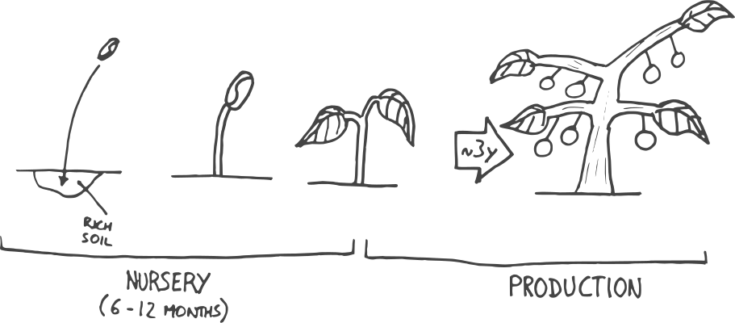

# Coffee

### Processing

#### Natural Process

* Unripe cherries are removed
* Remaining ones are spread out on a brick patio or raised drying tables to dry them under the sun. 
* They are turned regularly to prevent rotting 
* Once dry the skin and fruit are removed mechanically

Natural processing may add a fruity taste like: blueberry, strawberry or tropical fruits. But sometimes add a negative like barnyard, wild, ferment and manure.

#### Washed Process

* Unripe cherries are removed
* The skin and fruit flesh are removed
* Washed and fermented to removed leftovers
* Dried under the sun on brick patio/drying tables

The result will generaly have a higher level of acidity, increased complexity and feeling of "cleaner cup"

### Scoring

| Score | Comment |
| :--- | :--- |
| 90 - 100 | Outstanding |
| 85 - 89.99 | Excellent |
| 80 - 84.99 | Very Good |

### Links

* [James Hoffmann](https://www.youtube.com/channel/UCMb0O2CdPBNi-QqPk5T3gsQ) \(Youtube\)
* [/r/coffee](https://www.reddit.com/r/coffee)

